# System Resource & Performance Monitor

A tool that watches your computer's health and learns from its behavior.

---

## TL;DR (Quick Summary)

**What is it?** A Windows monitoring tool that watches your computer's vital signs (CPU, RAM, disk, network) 24/7.

**How does it work?**
1. 🔍 **C Monitor** (watchdog) - Continuously collects performance data every 5 seconds
2. 💾 **Database** - Stores 30 days of history
3. 🧠 **Python Analyzer** - Uses AI to detect problems, spot patterns, and predict issues

**Why use it?** Detects unusual behavior, learns your normal patterns, and alerts you to problems before they cause trouble — like having a smart doctor for your computer.

**Quick Example:** If your CPU suddenly spikes to 95% or your memory slowly leaks over days, the system alerts you with explanations and recommendations.

---

## What is This Project?

**In simple terms:** This project is like a health monitor for your Windows computer. It:
1. **Watches** - Collects information about how much CPU, memory, and disk your computer is using (like taking vital signs)
2. **Records** - Saves this information in a database for the last 30 days
3. **Analyzes** - Uses smart algorithms to find unusual patterns (like detecting when something is wrong)
4. **Predicts** - Can warn you before problems happen

**Visual Example - Spotting Problems:**

```
Normal CPU Usage:        Problem - Sudden Spike:
████░░░░░░░░░░ 30%      ████████████████ 95% ⚠️

Normal Memory:           Problem - Memory Leak:
████████░░░░░░ 55%      ██████████████░░ 87% ⚠️

The system learns what's normal,
then alerts you when something unusual happens!
```

### What Can It Do?

- **Monitor Your Computer** - Tracks CPU, memory, disk, and network usage in real-time
- **Save History** - Keeps data for 30 days so you can see trends over time
- **Find Problems** - Uses artificial intelligence to detect unusual computer behavior
- **Spot Patterns** - Groups similar usage patterns together to understand your system better

## How Does It Work? (Architecture)

Think of this project as having two main parts working together:

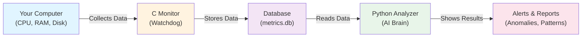

**The Flow:**
1. Your computer does stuff (runs programs, uses CPU, RAM, etc.)
2. The C Monitor watches and records everything (like a security camera)
3. The database stores this information (like a filing cabinet)
4. Python Analyzer reads the data and finds patterns
5. You get alerts and insights about what's happening

### Part 1: The Collector (C_Monitor Folder)
**What it does:** Acts like a security camera for your computer

This part runs in the background and:
- Takes snapshots of your computer's performance every 5 seconds
- Records things like: CPU usage, RAM usage, disk activity, and network activity
- Saves all this information to a database (like a filing cabinet)
- Works quickly and efficiently (written in C, a fast programming language)

**What it monitors:**
- **CPU** - How hard your processor is working (0-100%)
- **Memory** - How much RAM is being used
- **Disk** - Reading/writing data to hard drive
- **Network** - Internet traffic in and out
- **Processes** - Individual programs running and what they're using

### Part 2: The Analyzer (Python_Analysis Folder)
**What it does:** Looks at all the collected data and tries to find problems and patterns

This part:
- Reads all the saved data from the database
- Cleans up messy data (removes mistakes and outliers)
- Looks for unusual behavior using smart algorithms
- Groups similar patterns together
- Predicts trends (is something getting worse over time?)
- Creates charts and reports

**Main Algorithms Used:**
- **Anomaly Detection** - Finds things that don't look normal (like a sudden CPU spike)
- **Pattern Clustering** - Groups similar behaviors together (like "CPU always spikes at 3 PM")
- **Trend Analysis** - Shows if something is getting better or worse over time

### Part 3: The Storage (data Folder)
- Stores the database file (`metrics.db`) with all collected information
- This is like the filing cabinet that holds all the measurements

**Visual Breakdown of the Three Components:**

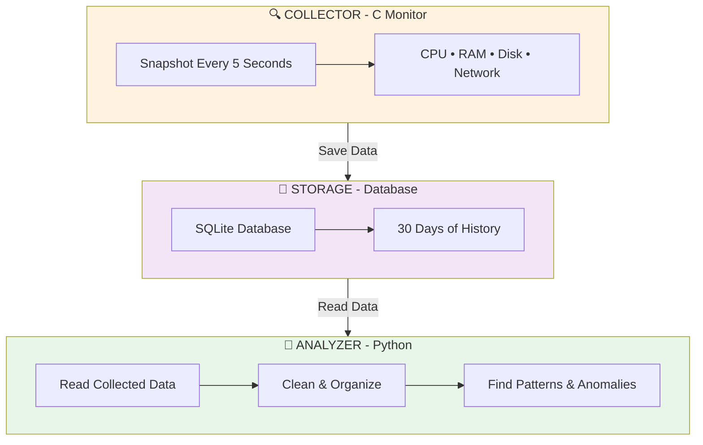

## Architecture Design & Concepts (Beginner-Friendly)

### The 3-Tier System (Like a Restaurant)

Think of our system like a **restaurant's workflow**:

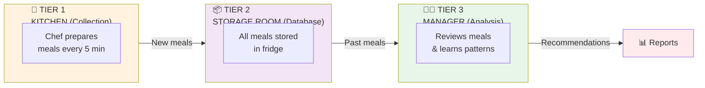

**Why 3 Layers?**

| Layer | Restaurant Analogy | Our System | Why Separate? |
|-------|---|---|---|
| Layer 1 | Chef cooking | C Monitor collecting data | Chef shouldn't worry about storage |
| Layer 2 | Fridge storage | Database saving data | Storage doesn't cook or analyze |
| Layer 3 | Manager reviewing | Python analyzer | Manager shouldn't cook or manage fridge |

**Benefits of Separation:**
- 🧑‍🍳 **Chef can keep cooking** even if manager is analyzing
- 💾 **Storage just stores** - doesn't need to know what happens next
- 👨‍💼 **Manager can take breaks** without stopping the kitchen
- 🔧 **Easy to upgrade** - replace chef without changing storage

---

### How the Data Flows (Real Example)

**The Assembly Line Approach:**

Your computer is like a **factory assembly line**:

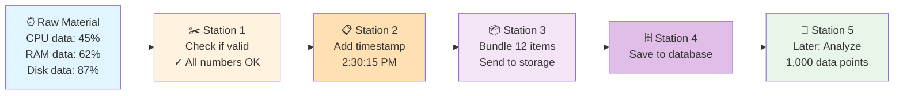

**What happens at each station:**
1. **Check Quality** - Is the data good? (No garbage numbers)
2. **Add Info** - When was this collected?
3. **Bundle Items** - Group 12 measurements together (saves space)
4. **Store** - Put in database filing cabinet
5. **Analyze Later** - When needed, analyze thousands of data points

**Key Idea:** Each step does ONE job well, then passes to the next.

---

### Analogy: The Factory vs The Office

```
🏭 COLLECTION PHASE (The Factory - Always Running)
   What: C Monitor continuously collects data
   When: Every 5 seconds (24/7)
   Goal: Never miss a measurement
   Speed: FAST (like a factory)
   
💾 STORAGE PHASE (The Filing Room - Just Keeps Files)
   What: Database saves everything
   When: As soon as it arrives
   Goal: Keep everything organized
   Speed: Very fast (just filing)
   
🧠 ANALYSIS PHASE (The Office - Smart Worker)
   What: Python analyzes the data
   When: Whenever you ask (on demand)
   Goal: Find patterns & problems
   Speed: Takes a bit longer (complex work)
```

**Important:** Factory (Collection) works 24/7. Office (Analysis) works when needed. They don't interfere with each other!

---

### Producer-Consumer Pattern (Food Delivery Analogy)

Imagine **food being delivered to your home**:

```
Restaurant (Producer)
   ↓ makes food (every 5 seconds)
Delivery Driver (Database)
   ↓ holds the food safely
Your Home (Consumer)
   ↓ you eat when ready
```

**Why this is good:**
- Restaurant doesn't wait for you to eat before making more food
- Driver safely keeps food from spoiling
- You can eat whenever you want (on demand)
- If you're busy, food doesn't go bad (it's in database)

---

### The Analysis Pipeline (Laundry Analogy)

Analyzing your data is like **doing laundry**:

```
Dirty Clothes (Raw Data 30 days)
    ↓
Wash (Load from database)
    ↓
Rinse (Remove errors & outliers)
    ↓
Dry (Fix data format - normalization)
    ↓
Iron (Prepare features for analysis)
    ↓
Fold & Sort (Run algorithms)
    ↓
Store in Closet (Generate report)
```

Each step is **necessary** and **depends on the previous one**:
- You can't dry without washing
- You can't fold without drying
- Each step must be done right

If one step fails, the rest won't work!

---

### What Each File Does

**C Code (The Collector):**

```
main.c
├─ Starts the monitor
├─ Sets up configuration  
└─ Runs the main loop (every 5 seconds)

metrics.c
├─ Gets CPU usage
├─ Gets RAM usage
├─ Gets disk activity
└─ Gets network activity

database.c
├─ Opens the database
├─ Saves data
└─ Manages the filing cabinet

utils.c
├─ Helper functions
├─ Configuration settings
└─ Logging (write down what happened)
```

**Python Code (The Analyzer):**

```
data_loader.py
└─ Opens database & reads data

preprocessing.py
├─ Cleans messy data
├─ Removes errors
└─ Organizes everything

anomaly_detection.py
└─ Finds weird stuff (spikes, leaks)

pattern_clustering.py
└─ Groups similar behaviors

trend_analysis.py
└─ Shows if things are getting better/worse

visualization.py
└─ Makes charts and reports
```

---

### Why This Design Is Good

```
✅ ONE JOB PER LAYER
   Collector: Just collect
   Database: Just store
   Analyzer: Just analyze
   
✅ INDEPENDENT WORK
   Monitor keeps running even if analyzer breaks
   Analyzer can be slow without affecting monitor
   
✅ EASY TO FIX
   Problem in collection? Fix metrics.c
   Problem in storage? Fix database.c
   Problem in analysis? Fix Python code
   
✅ EASY TO ADD NEW THINGS
   Want to track GPU? Add to metrics.c
   Want new algorithm? Add Python file
   Want new report format? Update visualization.py
```

---

### Data Size (How Much Space Does It Use?)

**Very Efficient!**

```
One measurement = ~100 bytes
Take 1 per 5 seconds = 17,280 per day
30 days = 518,400 measurements
Total size = 1-2 MB per day

Analogy: Like taking 1 photo every 5 seconds
for 30 days, but it only takes 1-2 MB total!
```

**Why so small?**
- Only storing numbers (CPU: 45, RAM: 62, etc.)
- Not storing images or videos
- Database compresses efficiently
- Batching (grouping) saves space

---

### Security: Keeping Data Safe

**Simple Rule: Read-Only Analysis**

```
Raw Data in Database
    ↓ (Read Only - Like a library book)
Python Analyzer
    ↓ (Never modifies original)
Results & Reports
    ↓ (Shows insights)
```

**Why this matters:**
- If analyzer makes a mistake, raw data is still safe
- Can rerun analysis with different algorithms
- Audit trail: can see exactly what was stored
- Data integrity: nothing gets accidentally changed

## Real-World Scenarios & End-to-End Examples

This section shows what actually happens in the system when real events occur. Think of these as stories about your computer's health.

### Scenario 1: Detecting a Sudden CPU Spike (The Emergency Room Analogy)

**Real-World Situation:** You're working and suddenly your computer slows down. A virus or resource-hungry program might have started.

**Analogy:** This is like a doctor's patient suddenly running a fever. The system needs to detect it quickly and alert the doctor.

**End-to-End Workflow:**

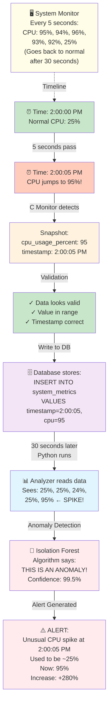

**What You Can Learn From This:**

| Time | What Happened | What System Did |
|------|---|---|
| 2:00:05 PM | CPU spike to 95% | C Monitor records it |
| 2:00:30 PM | Spike continues | Database fills with high CPU readings |
| 2:00:35 PM | Spike ends (CPU back to 25%) | Python Analyzer reviews data |
| 2:00:40 PM | Analysis complete | Alert sent: "Spike detected! Lasted 30 seconds" |

**If You Were the Doctor:** You'd now check what program used all that CPU, and decide if it's normal (video rendering) or suspicious (malware).

---

### Scenario 2: Detecting a Memory Leak (The Bathtub Analogy)

**Real-World Situation:** A program has a bug and keeps using more and more RAM without releasing it. Eventually your computer gets slow.

**Analogy:** Like a bathtub with a leak - water level keeps rising slowly. A good doctor checks if water stops draining properly!

**End-to-End Workflow:**

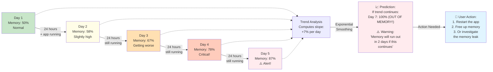

**Day-by-Day Breakdown:**

```
Database Records (simplified):

Day 1, 8 AM:  Memory = 50%  ✓ Normal
Day 2, 8 AM:  Memory = 58%  ⚠️ +8%
Day 3, 8 AM:  Memory = 67%  ⚠️ +9%
Day 4, 8 AM:  Memory = 78%  🚨 +11%
Day 5, 8 AM:  Memory = 87%  🚨 +9%

Trend Line (Linear Regression):
  y = 7.2x + 50.8
  
  Prediction for Day 7:
  y = 7.2(7) + 50.8 = 101%  ← OVERFLOW!
  
Alert: "Memory leak detected! 
        Will run out of RAM in ~2 days"
```

**Key Difference from Scenario 1:**
- **Spike (Scenario 1):** Immediate, obvious, temporary
- **Memory Leak (Scenario 2):** Gradual, subtle, permanent unless fixed

---

### Scenario 3: Finding Normal Usage Patterns (The Calendar Analogy)

**Real-World Situation:** Your computer has different usage patterns at different times. You work heavily in morning, light work after lunch, nothing at night.

**Analogy:** Like noting that you always go to the gym at 6 AM - it's normal. But going at 3 AM would be unusual!

**End-to-End Workflow:**

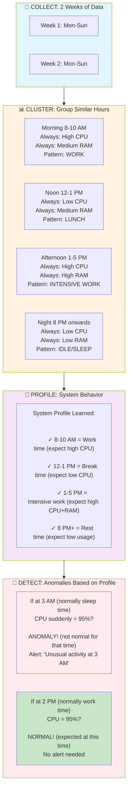

**Real Example Pattern:**

```
Hourly Usage Pattern (after analyzing 2 weeks):

Hour  │ CPU Usage        │ Interpretation
──────┼──────────────────┼─────────────────
8 AM  │ ████████░░░░░░░░ 50-70%  │ Morning work begins
9 AM  │ ███████████░░░░░ 70-80%  │ Full work mode
10 AM │ ████████░░░░░░░░ 50-65%  │ Slight dip
11 AM │ ███████████░░░░░ 70-85%  │ Rising again
12 PM │ ███░░░░░░░░░░░░░ 20-30%  │ Lunch break!
1 PM  │ ████████████░░░░ 80-95%  │ Afternoon heavy work
2 PM  │ ███████████░░░░░ 75-90%  │ Still working hard
3 PM  │ ████████░░░░░░░░ 50-65%  │ Winding down
5 PM  │ ████░░░░░░░░░░░░ 30-45%  │ Work ending
8 PM  │ ░░░░░░░░░░░░░░░░ 5-15%   │ Evening - minimal use
3 AM  │ ░░░░░░░░░░░░░░░░ 2-5%    │ Sleep time - just background
```

**Alert Logic:**

```
IF time = 3 AM AND cpu_usage > 50%:
    # This is VERY unusual for 3 AM
    ALERT: "Unusual activity: High CPU at 3 AM"
    REASON: "Usually CPU is 2-5% at this time"
    
IF time = 1 PM AND cpu_usage > 80%:
    # This is EXPECTED for 1 PM (afternoon work)
    STATUS: "Normal for this time"
    REASON: "Afternoon work time: usually 75-95%"
```

---

### Scenario 4: Complete End-to-End Journey - Your Computer Over One Week

**The Big Picture:**

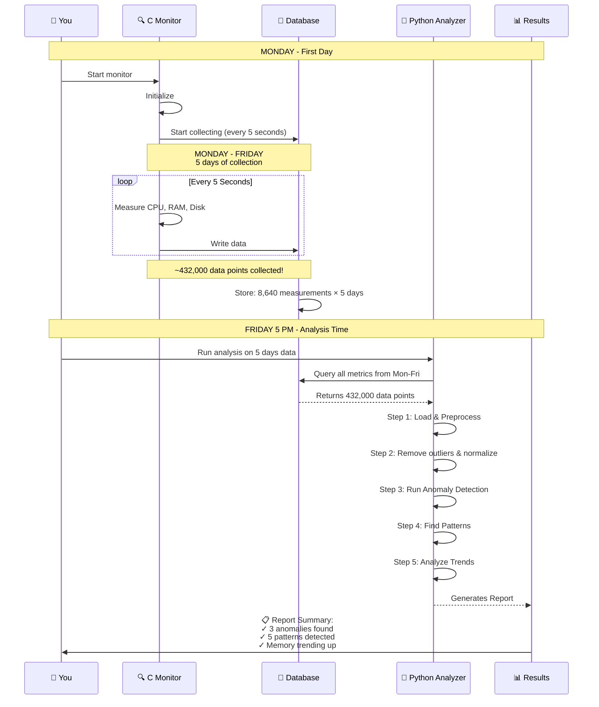

**What the Report Contains:**

```
📊 WEEKLY REPORT - System Health Analysis
Generated: Friday 5:30 PM
Period: Monday 12:00 AM - Friday 5:00 PM
Data Points: 432,000 measurements

═══════════════════════════════════════

🚨 ANOMALIES DETECTED (3):

1. Tuesday 3:15 AM - CPU Spike
   - Sudden jump from 5% to 87%
   - Duration: 45 seconds
   - Possible cause: System update check?
   
2. Wednesday 2:45 PM - Memory Spike
   - Jumped from 62% to 78%
   - Duration: 3 minutes
   - Returned to normal (was video encoding)
   
3. Thursday 1:30 AM - Disk Activity
   - High disk writes (unusual for night)
   - Duration: 2 minutes
   - Possible cause: Backup running

═══════════════════════════════════════

📈 PATTERNS FOUND (5):

✓ Morning Peak: 8-10 AM (CPU 60-75%)
  Every day: High work activity

✓ Lunch Dip: 12-1 PM (CPU 20-30%)
  Every day: Low activity pattern

✓ Afternoon Surge: 1-5 PM (CPU 70-85%)
  Every day: Secondary work peak

✓ Evening Low: 5 PM - 8 AM (CPU 5-20%)
  Every night: Minimal activity

✓ CPU-Memory Link: When CPU > 70%,
  RAM also goes up to 65-75%
  Shows correlated usage

═══════════════════════════════════════

📊 TRENDS & PREDICTIONS:

Memory Usage Trend: SLIGHTLY UP
  - Monday 8 AM: 48% RAM
  - Friday 8 AM: 52% RAM
  - Increase: +4% in one week
  - Predicted (30 days): 60% if continues
  - Status: ⚠️ Monitor this

CPU Usage Trend: STABLE
  - Average: 42% (consistent)
  - No concerning trend
  - Status: ✅ Normal

Disk Space Trend: STABLE
  - Average usage: 65%
  - Status: ✅ Normal

═══════════════════════════════════════

🎯 RECOMMENDATIONS:

1. ⚠️ Memory slowly increasing - check for:
   - Memory leaks in background apps
   - Accumulating browser tabs
   - Temporary files not being cleaned

2. ✅ CPU patterns are healthy - your work
   routine is stable and predictable

3. ✅ No critical issues detected this week
```

---

### How Each Algorithm Works - Real Example Comparison

**Same Scenario, Three Different Algorithms:**

Imagine this happens: CPU stays at 75% for 5 hours straight (unusual for this system).

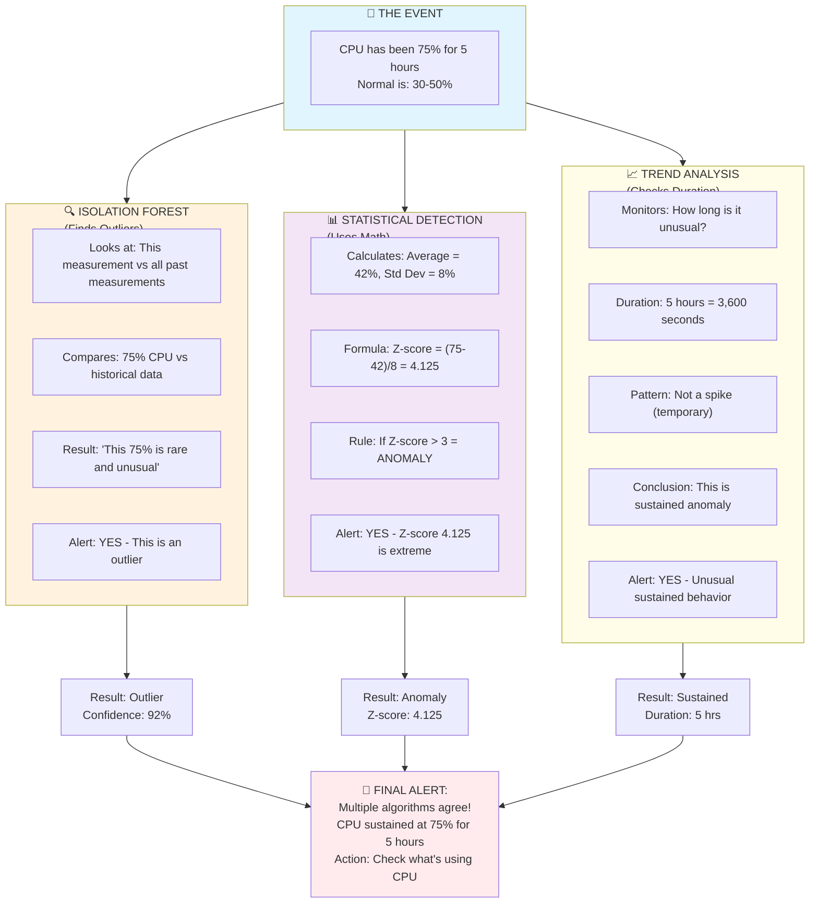

## Progress So Far (Phase 1 - Week 1)

**Project Timeline:**

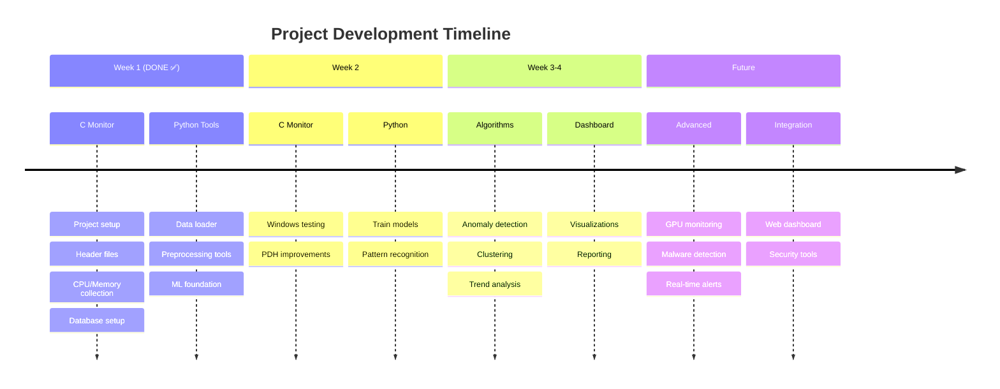

### What We've Built:

**The Monitoring Part (C Code):**
- ✅ Set up the project structure properly
- ✅ Created the monitoring program that runs in the background
- ✅ Made it collect CPU, memory, and process information
- ✅ Set up the database to store the data
- ✅ Added logging (keeps a record of what the program is doing)
- ✅ Made the main loop that keeps checking your system

**The Analysis Part (Python Code):**
- ✅ Created tools to read data from the database
- ✅ Created tools to clean up the data (remove errors, organize it)
- ✅ Set up the machine learning foundation

### What's Coming Next (Weeks 2-4):


## Getting Started - Building and Running the Monitor

- Test the monitor on a real Windows computer
- Improve CPU tracking to be more accurate
- Train the smart algorithms to recognize problems
- Build pattern recognition
- Create nice charts and dashboards to show what's happening

---

## Week 2: Model Training & Pattern Recognition (NOW IMPLEMENTED!)

### What is Week 2?

After Week 1 collected data, **Week 2 teaches the system to recognize patterns and anomalies**.

**Analogy:** Like teaching a doctor
- Week 1: Doctor examines 1000 healthy patients, records symptoms
- Week 2: Doctor studies all those records to learn what "healthy" looks like
- Week 3: Doctor can now diagnose sick patients (detect anomalies)

### Week 2 Components

#### 1. **PDH Helper (Windows Performance Data Helper)**

**What it does:**
- Provides easy access to Windows system metrics
- Gets accurate per-process data (which program uses how much CPU/disk/memory?)
- More accurate than basic Windows API calls

**New File:** `C_Monitor/src/pdh_helper.c`

**Key Functions:**
- `pdh_init_query()` - Start monitoring
- `pdh_get_cpu_usage()` - Get system CPU usage
- `pdh_get_all_processes()` - List all running programs & their resource usage
- `pdh_get_top_processes_by_cpu()` - Find the programs using the most CPU

**Why it matters:**
- More accurate than basic methods
- Per-process tracking (see individual program usage)
- Professional-grade monitoring

#### 2. **Anomaly Detection Model Training**

**What it does:**
- Trains two different anomaly detection algorithms
- Learns what your system's "normal" looks like
- Saves trained models for real-time detection

**New File:** `Python_Analysis/models/anomaly_detector_trainer.py`

**Algorithms Trained:**

| Algorithm | What It Does | Analogy |
|---|---|---|
| **Isolation Forest** | Finds outlier data points | Finding someone wearing unusual clothes in a crowd |
| **Local Outlier Factor** | Finds points with unusual local density | Finding someone whose neighbors are all very different |

**How it works:**
1. Load 30 days of collected metrics
2. Prepare/clean the data
3. Train on 80% of data (learning set)
4. Test on 20% of data (validation)
5. Save trained models to disk

**Example - What Gets Detected:**
```
Normal Data:
    CPU: 20%, 22%, 21%, 19%, 23%
  
Anomaly:
    CPU: 95% ← Way different!
  
Isolation Forest says: "99% likely an anomaly!"
LOF says: "Very unusual local pattern!"
```

**Output Models:**
- `models/anomaly_isolation_forest.pkl` - Trained Isolation Forest
- `models/anomaly_lof.pkl` - Trained LOF model
- `models/scaler.pkl` - Data preprocessor

#### 3. **Pattern Clustering Model Training**

**What it does:**
- Groups similar system behaviors together
- Learns what's "normal" at different times (2 PM work time vs 3 AM sleep time)
- Enables context-aware anomaly detection

**New File:** `Python_Analysis/models/pattern_clustering_trainer.py`

**Algorithms Trained:**

| Algorithm | What It Does | Analogy |
|---|---|---|
| **K-Means** | Divides data into K groups | Organizing closet into 5 different outfits |
| **DBSCAN** | Groups by density (finds K automatically) | Friends naturally clustering at a party |

**Features Used for Clustering:**
- **Temporal:** Hour of day (0-23), day of week (Mon-Sun)
- **Behavioral:** CPU %, memory, disk I/O, network usage
- **Trends:** Smoothed averages, rate of change

**Example - Learned Patterns:**

```
Pattern #1: "Morning Work"
├─ Time: 8-10 AM
├─ Avg CPU: 65%
├─ Avg RAM: 45%
└─ This is NORMAL for morning

Pattern #2: "Lunch Break"
├─ Time: 12-1 PM
├─ Avg CPU: 20%
├─ Avg RAM: 35%
└─ This is NORMAL for lunch

Pattern #3: "Sleep Time"
├─ Time: 11 PM - 7 AM
├─ Avg CPU: 5%
├─ Avg RAM: 30%
└─ This is NORMAL for sleep

Now the system understands CONTEXT:
├─ 95% CPU at 2 PM → Normal (work time) ✓
├─ 95% CPU at 3 AM → ANOMALY (should be sleeping) 🚨
└─ 95% CPU at work time but for 5 minutes only → Normal
```

**Output Models:**
- `models/kmeans_patterns.pkl` - K-Means clustering model
- `models/dbscan_patterns.pkl` - DBSCAN clustering model
- `models/clustering_scaler.pkl` - Data preprocessor

### How to Run Week 2 Training

#### Step 1: Make Sure Week 1 is Complete

You need at least a few hours of collected data (more is better):

```bash
# Check if database exists
dir data/metrics.db

# If not, run the monitor first:
.\bin\system_monitor.exe
# Let it run for at least 1-2 days for best results
# Press Ctrl+C to stop
```

#### Step 2: Run Week 2 Training

```bash
# Go to Python directory
cd Python_Analysis

# Activate virtual environment
venv\Scripts\activate

# Run complete training pipeline
python run_week2_training.py
```

**What you'll see:**

```
══════════════════════════════════════════════════════════
WEEK 2: MACHINE LEARNING MODEL TRAINING
══════════════════════════════════════════════════════════

[Validation] Checking database... ✓ Found (45.23 MB)

[AnomalyDetection] Loading 30 days of data...
[AnomalyDetection] Loaded 432000 data points
[AnomalyDetection] Training Isolation Forest...
[AnomalyDetection]   - Anomalies detected: 21600 (5%)

[Clustering] Loading data with temporal features...
[Clustering] Training K-Means...
[Clustering]   Testing K=3... Score: 0.543
[Clustering]   Testing K=5... Score: 0.658 ← Best!

✅ TRAINING COMPLETE!
Models saved to: models/
```

### Week 2 Output Files

**Trained Models (4 total):**
```
models/
├── anomaly_isolation_forest.pkl    ← Detects outliers
├── anomaly_lof.pkl                 ← Detects density anomalies
├── kmeans_patterns.pkl             ← Behavioral patterns
├── dbscan_patterns.pkl             ← Auto-clustered patterns
├── scaler.pkl                      ← Data normalizer
├── clustering_scaler.pkl           ← Clustering normalizer
└── training_report.txt             ← Summary report
```

**What These Models Do:**
- 🔍 Detect anomalies in new data (unusual CPU, memory, disk usage)
- 📊 Understand normal behavior patterns at different times
- 🚨 Enable smart, context-aware alerts
- 📈 Predict expected resource usage

### Week 2 Example: Real-World Scenario

**Scenario 1: Normal Data**
```
New measurement arrives:
    Time: 2:00 PM (afternoon, work time)
    CPU: 78%
    Memory: 62 MB

Analysis:
    ✓ Pattern says: 2 PM is work time, expect 60-80% CPU
    ✓ Isolation Forest: Within normal range
    ✓ LOF: Normal density
  
Result: ✅ NORMAL - No alert
```

**Scenario 2: Anomalous Data**
```
New measurement arrives:
    Time: 3:15 AM (night, should be sleeping)
    CPU: 95%
    Memory: 88 MB

Analysis:
    🚨 Pattern says: 3 AM usually 5% CPU, this is 95%
    🚨 Isolation Forest: ANOMALY DETECTED
    🚨 LOF: HIGHLY UNUSUAL
  
Result: 🚨 ALERT
    Message: "Unusual CPU at 3 AM - investigate"
    Suggested action: Check Task Manager for culprit
```

---

## Week 3: Live Detection and Alerts

### What is Week 3?

Week 3 is where the system starts acting like a live alarm system.

**Week 1** collected the data.
**Week 2** learned what normal looks like.
**Week 3** asks: "Is this happening now, and does it look dangerous?"

**Analogy:**
- Week 1 = the doctor writes down your health readings
- Week 2 = the doctor learns your normal pattern
- Week 3 = the doctor checks you right now and says, "Something is wrong"

### What this part does

This is the part that turns raw measurements into warnings.
It checks things like:
- CPU is too high
- memory is climbing too much
- too many processes are running
- sudden unusual spikes in data

**New files:**
- `Python_Analysis/real_time_alerts.py`
- `Python_Analysis/run_week3_4_pipeline.py`

### Example: When an alert happens

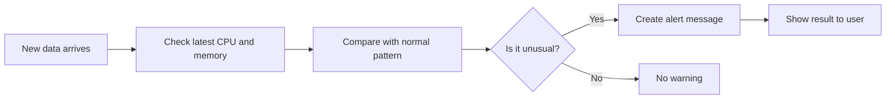

**Simple real-world example:**

```
Latest reading:
    CPU = 92%
    Memory = 80%

System says:
    "CPU is too high right now. This may be a problem."
```

This is helpful because the system does not just store numbers.
It tries to tell you: "This is worth checking."

### Why it matters

Without Week 3, the project is just collecting data.
With Week 3, the project starts helping you react.

This is the difference between:
- "I have data"
- and "I have a warning that something might be wrong"

---

## Week 4: Dashboard and Reports

### What is Week 4?

Week 4 makes the data easier to understand at a glance.

Instead of reading raw numbers, you get a simple dashboard and summary report.

**Analogy:**
- Week 1 = collecting the notes
- Week 2 = learning the patterns
- Week 3 = warning you about problems
- Week 4 = putting everything on one page like a health dashboard

### What this part does

The dashboard helps you see:
- CPU over time
- memory usage over time
- process count over time
- average CPU by hour
- quick summary of recent health

**New file:**
- `Python_Analysis/dashboard_report.py`

### Example: What the dashboard might show

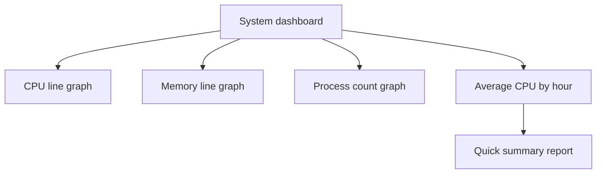

**Example summary:**

```
Week 4 System Health Summary
- CPU average: 42%
- CPU peak: 93%
- Memory average: 58 MB
- Memory peak: 79 MB
- Alert count: 1
```

This is useful because it makes the system easier for a person to read without opening the database.

### Why a dashboard matters

A dashboard is like a doctor’s chart:
- one page
- quick to read
- highlights the important parts
- helps you decide what to do next

---

## The Big Picture Across All 4 Weeks

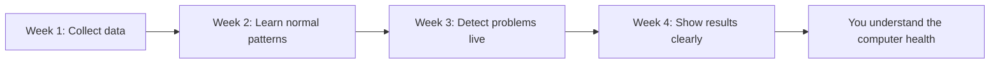

### In very simple words:
- Week 1 = watch
- Week 2 = learn
- Week 3 = warn
- Week 4 = explain clearly

That is the full idea of the project.

---

## Getting Started - Building and Running the Monitor

**Quick Overview - What Happens:**

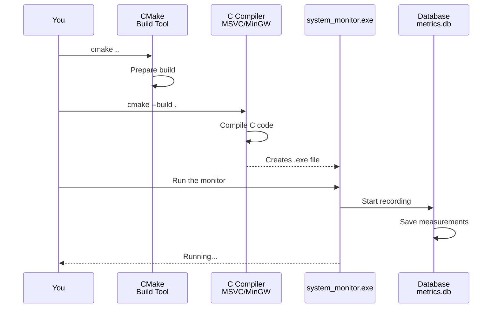

### What You Need First (Prerequisites)

Before you can run this project, make sure you have:
- **Windows 10 or 11** - The operating system (this only works on Windows)
- **CMake 3.10+** - A tool that helps build the C code (download from cmake.org)
- **A C Compiler** - Either:
  - Visual Studio 2019 or newer (includes MSVC compiler), OR
  - MinGW (a free alternative)
- **SQLite3** - Already bundled into this project, so you do not need to install it separately

Don't know if you have these? Open Command Prompt and type:
- `cmake --version` - Check CMake
- `cl` - Check for MSVC compiler
- `gcc --version` - Check for MinGW

### How to Build (Step by Step)

1. Open Command Prompt or PowerShell
2. Copy and paste these commands:

```bash
cd c:\Users\irava\Projects\System-Resource-Performance-Monitor
mkdir build
cd build
cmake ..
cmake --build . --config Release
```

**What just happened:**
- Line 1: Move to the project folder
- Line 2: Create a "build" folder (where the compiled program goes)
- Line 3: Move into the build folder
- Line 4: Prepare the build (creates the build instructions)
- Line 5: Build the program (compiles the C code into an .exe file)

### Running the Program

After building completes, run:

```bash
.\build\bin\Release\system_monitor.exe
```

If that exact path does not exist, find the executable with:

```powershell
Get-ChildItem .\build -Filter system_monitor.exe -Recurse
```

**What it does:**
- Starts monitoring your system immediately
- Saves all data to `data/metrics.db` (a database file)
- Creates a log file at `system_monitor.log` (shows what it's doing)
- Keeps running until you press `Ctrl+C` to stop it

## Run the Whole Project (Simple Order)

Run the project in this order. The Python programs need the database created by the C monitor.

### Step 1: Build the C monitor

Run these commands from the main project folder:

```powershell
cd C:\Users\irava\Projects\System-Resource-Performance-Monitor
cmake -S . -B build
cmake --build build --config Release
```

### Step 2: Collect data

Start the monitor:

```powershell
.\build\bin\Release\system_monitor.exe
```

Leave it running while it collects data. For a quick test, a few minutes is enough to confirm that it works. For useful machine-learning results, collect several hours or days of data.

When you want to stop it, press `Ctrl+C`.

This creates or updates:

```text
data\metrics.db
system_monitor.log
```

### Step 3: Set up Python once

Open a new PowerShell window in the main project folder:

```powershell
cd C:\Users\irava\Projects\System-Resource-Performance-Monitor
py -3 -m venv Python_Analysis\venv
Python_Analysis\venv\Scripts\Activate.ps1
python -m pip install -r Python_Analysis\requirements.txt
```

If `py -3` is unavailable, install Python 3 and make sure the Python launcher is enabled. You should see `(venv)` at the start of the command prompt after activation.

### Step 4: Train the Week 2 models

Stay in the main project folder and run:

```powershell
python Python_Analysis\run_week2_training.py
```

This reads `data\metrics.db` and saves trained model files in:

```text
Python_Analysis\models\
```

### Step 5: Run Weeks 3 and 4

Run the live alert check and dashboard/report pipeline:

```powershell
python Python_Analysis\run_week3_4_pipeline.py
```

The results are saved in:

```text
reports\system_dashboard.png
reports\week4_summary.md
```

### The complete flow

```text
Build C monitor
    ↓
Run C monitor and collect data
    ↓
data\metrics.db
    ↓
Train Week 2 models
    ↓
Run Week 3 alerts and Week 4 dashboard
    ↓
reports\system_dashboard.png
reports\week4_summary.md
```

You do not run every `.c` or `.py` file yourself. Most files are helper files. You run the monitor executable, then the two pipeline scripts.

## Using Python to Analyze the Data

**What Happens During Analysis:**

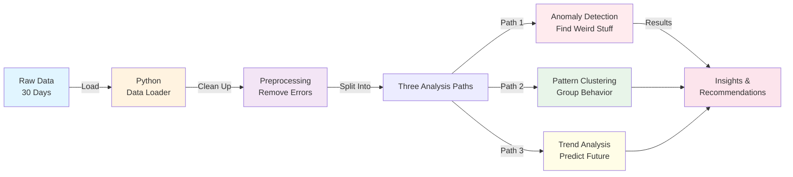

### Setting Up Python (One Time Setup)

A "virtual environment" is like a separate workspace just for this project. It keeps this project's tools separate from other Python projects on your computer.

**Steps:**

1. Open PowerShell in the main project folder:

```bash
cd C:\Users\irava\Projects\System-Resource-Performance-Monitor
```

2. Create the virtual environment:

```bash
py -3 -m venv Python_Analysis\venv
```

3. Activate it (turn it on):

```bash
Python_Analysis\venv\Scripts\Activate.ps1
```

You'll know it worked when you see `(venv)` at the start of your command line.

4. Install the required tools:

```bash
python -m pip install -r Python_Analysis\requirements.txt
```

This downloads all the Python libraries (tools) needed for analysis.

### Analyzing Your Data (Simple Example)

Here's Python code that shows how to:
1. Read the collected data from the database
2. Clean it up
3. Find unusual behavior

```python
from data_loader import MetricsDataLoader
from preprocessing import MetricsPreprocessor
from models.anomaly_detection import AnomalyDetector

# Step 1: Connect to the database and load data
loader = MetricsDataLoader('data/metrics.db')
loader.connect()
df = loader.load_system_metrics()

# Step 2: Clean up the data (remove errors, organize it)
preprocessor = MetricsPreprocessor()
df_clean = preprocessor.prepare_for_ml(df)

# Step 3: Find unusual patterns (anomalies)
detector = AnomalyDetector()
# Look at these three measurements
features = ['cpu_usage_percent', 'memory_mb', 'process_count']
df_anomalies, _ = detector.detect_isolation_forest(df_clean, features)

# Step 4: Close the database connection
loader.disconnect()
```

**What each part does:**
- `from ...` - Imports (loads) the tools we need
- `loader.connect()` - Opens the database
- `load_system_metrics()` - Reads all the collected data
- `prepare_for_ml()` - Fixes the data (removes mistakes)
- `detect_isolation_forest()` - Finds unusual patterns using an AI algorithm
- `loader.disconnect()` - Closes the database

## Customizing How the Monitor Works (Configuration)

The monitor has default settings, but you can change them if you want. The settings are in the code file `C_Monitor/src/utils.c`. Here are the main ones:

**Default Settings:**
- **Sample Interval: 5 seconds** - Takes a measurement every 5 seconds (faster = more data, but uses more disk space)
- **Data Kept: 30 days** - Only keeps the last 30 days of data (older data is deleted)
- **Database Location: data/metrics.db** - Where the data is saved
- **Track Individual Programs: OFF** - Currently doesn't track individual app usage (you can turn this on)

**To Change a Setting:**

Edit the `C_Monitor/src/main.c` file and look for lines like:
```c
config->enable_process_monitoring = 1;
```

- `0` = OFF (don't do this)
- `1` = ON (do this)

Then rebuild the program using the build instructions above.

## What Data Gets Saved? (Database Schema)

**How the Data is Organized:**

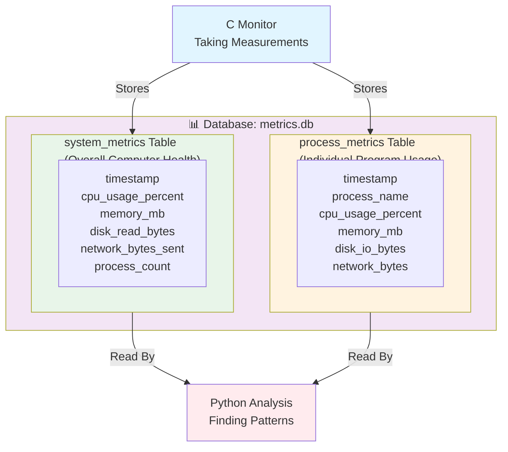

The program saves two types of data in the database:

### Main Measurements (system_metrics Table)

This table stores overall computer measurements:

| What's Recorded | Meaning |
|---|---|
| **timestamp** | When the measurement was taken (date and time) |
| **cpu_usage_percent** | How hard the processor is working (0-100%) |
| **memory_mb** | How much RAM is being used (in megabytes) |
| **memory_available_mb** | How much RAM is free and available |
| **disk_read_bytes** | How much data was read from disk |
| **disk_write_bytes** | How much data was written to disk |
| **network_bytes_sent** | Internet data sent out |
| **network_bytes_recv** | Internet data received |
| **process_count** | Total number of programs running |
| **cpu_temp_celsius** | CPU temperature in degrees (for future use) |

### Individual Program Usage (process_metrics Table)

This table stores information about specific programs:

| What's Recorded | Meaning |
|---|---|
| **timestamp** | When the measurement was taken |
| **process_id** | Windows ID number for the program |
| **process_name** | Name of the program (like "chrome.exe") |
| **cpu_usage_percent** | How much CPU that program is using |
| **memory_mb** | How much RAM that program is using |
| **disk_io_bytes** | How much disk activity that program caused |
| **network_bytes** | How much internet that program used |

**Real Example:**

If Chrome is using 40% CPU and 500 MB of RAM, that would show up in the process_metrics table with:
- process_name: "chrome.exe"
- cpu_usage_percent: 40
- memory_mb: 500

## Smart Algorithms (Machine Learning Models)

**Which Algorithm Does What?**

```mermaid
graph TB
    subgraph Anomaly["🚨 ANOMALY DETECTION<br/>Finds Problems"]
        A1["Isolation Forest"]
        A2["Statistical Detection"]
        A3["CPU Spike Detection"]
        A1 -.→ A2 -.→ A3
    end
    
    subgraph Clustering["📊 PATTERN CLUSTERING<br/>Groups Similar Behavior"]
        C1["Temporal Patterns"]
        C2["Hourly Patterns"]
        C3["CPU-Memory Relationships"]
        C1 -.→ C2 -.→ C3
    end
    
    subgraph Trend["📈 TREND ANALYSIS<br/>Predicts Future"]
        T1["Exponential Smoothing"]
        T2["Linear Regression"]
        T3["Seasonality Detection"]
        T1 -.→ T2 -.→ T3
    end
    
    Input["Your System Data"] -->|"Pass Through"| Anomaly
    Input -->|"Pass Through"| Clustering
    Input -->|"Pass Through"| Trend
    
    Anomaly --> Output["Better Understanding<br/>of Your System"]
    Clustering --> Output
    Trend --> Output
    
    style Anomaly fill:#ffebee
    style Clustering fill:#e8f5e9
    style Trend fill:#fffde7
    style Input fill:#e1f5ff
    style Output fill:#f3e5f5
```

This project uses three types of intelligent algorithms to understand your system:

### 1. Anomaly Detection (Finding Unusual Behavior)

**Purpose:** Find when something strange is happening

**Methods Used:**
- **Isolation Forest** - An algorithm that finds "odd one out" data points (like finding a red marble in a bag of blue marbles)
- **Statistical Detection** - Uses math to find things that don't fit the normal pattern
- **CPU Spike Detection** - Specifically watches for sudden CPU usage spikes (when CPU jumps to 100%)

**Real Example:**
- Your CPU is normally 20% - that's normal
- Suddenly it jumps to 95% - that's an anomaly! The algorithm flags this

### 2. Pattern Clustering (Grouping Similar Behavior)

**Purpose:** Group similar computer behavior together to find patterns

**Methods Used:**
- **Temporal Patterns** - Groups similar computer states together (like finding times when the system behaves the same way)
- **Hourly Patterns** - Finds patterns by time of day (example: "CPU always spikes at 3 PM")
- **CPU-Memory Relationships** - Looks for things that happen together (example: "When CPU goes up, RAM goes up too")
- **Anomalous Patterns** - Finds patterns that are unusual compared to normal

**Real Example:**
- Your computer always uses a lot of CPU at lunch time when you're rendering videos
- The algorithm learns this pattern and doesn't flag it as a problem

### 3. Trend Analysis (Predicting the Future)

**Purpose:** Show how things are changing over time and predict what will happen

**Methods Used:**
- **Exponential Smoothing** - Smooths out jumpy data to see the real trend
- **Linear Regression** - Draws a straight line through data to show if something is going up or down
- **Seasonality Detection** - Finds patterns that repeat (example: "Every Monday is busy")
- **Change Point Detection** - Finds the exact moment when something changed

**Real Example:**
- Memory usage has been slowly going up every week
- The algorithm predicts you'll run out of RAM in 2 weeks
- You can clean up or upgrade before there's a problem

---

## Understanding Anomalies: What Does It Actually Mean?

### The Key Question: Is an Anomaly "Bad"?

**Short Answer:** Not always! An anomaly just means "unusual" — it could be normal, expected, or concerning.

**Analogy:** Your heart rate is an "anomaly" when you're running, but it's not bad — it's expected!

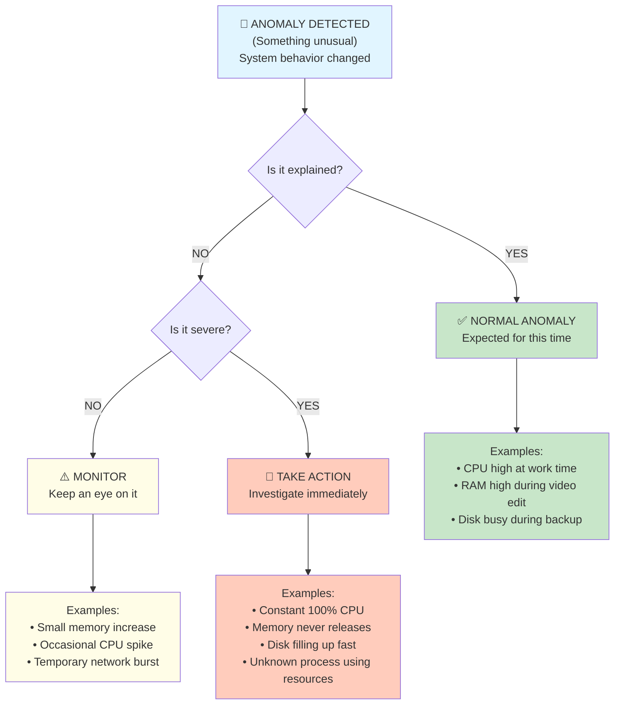

---

### Different Types of Anomalies Explained

#### 1. **CPU Anomalies - What They Mean**

**What it monitors:** How hard your processor is working

| Situation | What It Means | Is It Bad? | What To Do |
|-----------|---|---|---|
| **CPU suddenly 95% at 2 PM (your work time)** | You're probably coding/rendering | ✅ Normal | Keep working, monitor for 🔄 excessive heat |
| **CPU 95% at 3 AM (sleep time)** | Computer doing something unusual | ⚠️ Possibly | Check Windows logs: update? backup? |
| **CPU constant 100% all day** | Something won't stop | 🚨 Bad | Find what's running, use Task Manager |
| **CPU spikes to 95% then back to 20% (quick)** | Brief task completed | ✅ Normal | No action needed |
| **CPU slowly climbing over days** | Resource leak | ⚠️ Concerning | Check for malware, restart apps |

**Real World Example - CPU Spike:**

```
Scenario: CPU jumps from 30% → 98%

Investigate:
├─ 2 PM during work? → YOU'RE PROBABLY JUST WORKING HARD ✅
├─ 3 AM while sleeping? → SOMETHING'S WRONG 🚨
│  └─ Open Task Manager
│  └─ Look for unfamiliar processes
│  └─ Examples: crypto miner, malware, Windows update
└─ Duration?
   ├─ 30 seconds? → Probably just a program starting (OK)
   └─ 5+ minutes? → Something's stuck (investigate)
```

---

#### 2. **RAM (Memory) Anomalies - What They Mean**

**What it monitors:** How much computer memory is being used

| Situation | What It Means | Is It Bad? | What To Do |
|-----------|---|---|---|
| **Memory 50% → 80% during video editing** | Video editor uses a lot of RAM | ✅ Normal | This is expected behavior |
| **Memory slowly goes 50% → 55% → 60% → 70%** | Memory leak (program not releasing it) | ⚠️ Concerning | Restart the leaking program |
| **Memory 90% all the time** | Running out of RAM | 🚨 Bad | Close apps or upgrade RAM |
| **Memory jumps 40% → 85%, then back to 40%** | Brief intensive task | ✅ Normal | No action needed |
| **Memory 50%, stays there for weeks** | Stable usage | ✅ Normal | Everything is fine |

**Analogy - The Backpack Story:**

```
Your backpack (RAM) = Computer memory

Normal: You put stuff in (50%), take stuff out (40%), no problem
└─ This is HEALTHY

Memory Leak: You put stuff in (50%), don't take stuff out
├─ Day 1: 50% (full of stuff)
├─ Day 2: 60% (more stuff, didn't empty)
├─ Day 3: 70% (even more stuff piling up)
├─ Eventually: 100% (can't carry anymore!)
└─ This is a PROBLEM

Action: Empty the backpack (restart the program)
```

**Prediction Example:**

```
If memory grows 5% per day:
  Day 1: 50%
  Day 5: 70%
  Day 10: 100% (FULL!) ← System will crash

System can warn: "Memory growing. Will be full in 10 days"
Action: Restart programs or add more RAM before it's full
```

---

#### 3. **Disk Anomalies - What They Mean**

**What it monitors:** Hard drive activity and space

| Situation | What It Means | Is It Bad? | What To Do |
|-----------|---|---|---|
| **Disk busy for 5 minutes, then quiet** | Backing up files, copying, or update | ✅ Likely normal | Check if it's expected (backup time?) |
| **Disk constantly thrashing (high activity)** | System reading/writing constantly | ⚠️ Concerning | Could be antivirus, indexing, or disk error |
| **Disk space slowly decreasing** | Accumulating files/downloads | ⚠️ Monitor | Check what's using space, clean up |
| **Disk suddenly full 95%+** | Storage almost gone | 🚨 Bad | Delete files or upgrade storage |
| **Disk activity high at 2 AM every night** | Scheduled backup running | ✅ Normal | This is expected backup behavior |

---

#### 4. **Network Anomalies - What They Mean**

**What it monitors:** Internet data going in/out

| Situation | What It Means | Is It Bad? | What To Do |
|-----------|---|---|---|
| **Network burst (1 GB in 5 min)** | Downloading file, video streaming | ✅ Normal | No action needed |
| **Constant network activity 24/7** | Background syncing or updates | ⚠️ Check | Is it cloud sync, Windows Update, etc.? |
| **Network active at 3 AM** | Something uploading without permission | 🚨 Suspicious | Check Task Manager for unfamiliar network apps |
| **Sudden unusual transfer to unknown IP** | Possible data theft | 🚨 Bad | Could be malware, disconnect and scan |

---

### Decision Tree: What To Do When You See an Anomaly

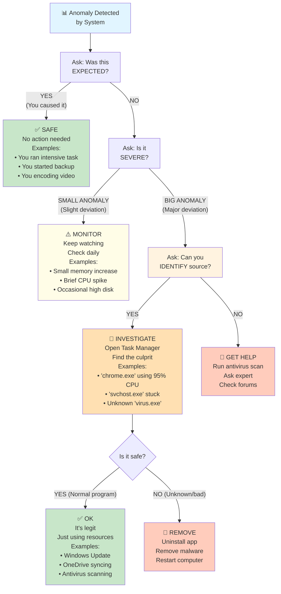

---

### Quick Reference: Normal vs Concerning

**CPU Usage Patterns (Examples):**

```
NORMAL ✅
━━━━━━━━━━━━━━━━━━━━━━━━━
• 8 AM: 60% (start work)
• 12 PM: 30% (lunch break)
• 2 PM: 70% (afternoon work)
• 6 PM: 20% (wrapping up)
• 10 PM: 5% (sleeping)

These changes are EXPECTED and HEALTHY

━━━━━━━━━━━━━━━━━━━━━━━━━

CONCERNING 🚨
━━━━━━━━━━━━━━━━━━━━━━━━━
• 100% CPU for 10 hours straight
• CPU spikes randomly, not during work
• 95% CPU at 3 AM every night
• CPU slowly climbing day after day
• Unknown process eating 80% CPU

These changes need INVESTIGATION
```

**RAM Usage Patterns (Examples):**

```
NORMAL ✅
━━━━━━━━━━━━━━━━━━━━━━━━━
• Morning: 45% (startup)
• Afternoon: 65% (heavy work)
• Evening: 50% (cooling down)
• Next day: 45% (back to normal)

Rises and falls with ACTIVITIES you do

━━━━━━━━━━━━━━━━━━━━━━━━━

CONCERNING 🚨
━━━━━━━━━━━━━━━━━━━━━━━━━
• Day 1: 50%
• Day 2: 58%
• Day 3: 67%
• Day 4: 78%
• Day 5: 88%

NEVER GOES DOWN = Memory Leak!
```

---

### Real-World Troubleshooting Examples

#### Example 1: "My CPU is at 95% but I'm not doing anything"

**What to do:**

```
Step 1: Check the time
├─ 2 PM? → You might have apps running in background
├─ 3 AM? → Something strange is happening
└─ At work time? → Normal productivity apps

Step 2: Open Task Manager
├─ Windows 10/11: Press Ctrl+Shift+Esc
└─ Look at "Processes" tab

Step 3: Check what's using CPU
├─ chrome.exe 40% → Browser (normal, maybe you have many tabs)
├─ Visual Studio 35% → You're coding (normal)
├─ svchost.exe 20% → Windows service (probably Windows Update)
├─ unknown.exe 60% → Unfamiliar program (INVESTIGATE!)
└─ Total doesn't reach 95%? → Displays incorrectly, reboot

Step 4: Take action
├─ If it's YOUR program → Just let it run or close it
├─ If it's Windows (svchost, update) → Let it complete
├─ If it's UNKNOWN → Research it:
│  ├─ Google the filename
│  ├─ If it's malware → Run antivirus
│  └─ If it's weird → Uninstall the app that installed it
```

#### Example 2: "My RAM keeps growing every day"

**What to do:**

```
Step 1: Identify the pattern
├─ Day 1: 40%
├─ Day 2: 48%
├─ Day 3: 56%
├─ Day 4: 64%
└─ Trend: +8% per day = LEAK

Step 2: Check what app
├─ Open Task Manager
├─ Click "Processes" tab
├─ Look at "Memory" column
├─ Sort by highest memory usage
└─ Identify the biggest memory hog

Step 3: Is it normal?
├─ Microsoft Edge 1.2 GB → Normal for browser with many tabs
├─ Visual Studio 2.1 GB → Normal for IDE
├─ Game 3.5 GB → Normal during gaming
├─ Random.exe growing 100 MB/hour → ABNORMAL LEAK!

Step 4: Fix it
├─ Restart the app → Usually fixes memory leaks
├─ Close browser tabs → Frees up RAM
├─ Uninstall buggy app → Prevents future leaks
└─ Restart computer → Clears all memory
```

#### Example 3: "My disk is getting full fast"

**What to do:**

```
Step 1: Check how fast it's growing
├─ One month ago: 50% full
├─ Today: 75% full
└─ Growing 25% per month? = Concerning

Step 2: Find what's taking space
├─ Windows: Settings → System → Storage
├─ Look at "Storage usage by category"
├─ OR download WinDirStat (free tool) for detailed view

Step 3: What's eating space?
├─ Downloads folder → Old files to delete
├─ Temp folder → Windows garbage, safe to delete
├─ Old backups → Unnecessary, can delete
├─ Games → Take up space, uninstall unused ones
├─ Photos/Videos → Archive to external drive
└─ Unknown huge folder → Investigate

Step 4: Clean up
├─ Delete unnecessary files
├─ Empty Recycle Bin
├─ Run Disk Cleanup (Windows tool)
└─ Monitor going forward
```

---

### When Should You Worry? Severity Scale

```
🟢 GREEN (All Good)
├─ CPU: 20-60% during work, 5-15% idle
├─ RAM: 40-70% (varies with activities)
├─ Disk: <80% full
├─ Network: Normal browsing/usage
└─ Action: None needed, system is healthy

🟡 YELLOW (Watch It)
├─ CPU: Often 70-80% (but you're doing heavy work)
├─ RAM: Slowly trending up 2-3% per week
├─ Disk: 80-90% full
├─ Network: Occasional high activity
└─ Action: Monitor for worsening, plan upgrade if needed

🔴 RED (Take Action Now)
├─ CPU: Constant 95-100% unexplained
├─ RAM: Rapidly trending up 5%+ per day
├─ Disk: >90% full or filling daily
├─ Network: Unusual high activity to unknown destinations
└─ Action: Investigate immediately, could be malware/problems
```

## Checking If Everything Is Working (Performance Monitoring)

**Troubleshooting Flow Chart:**

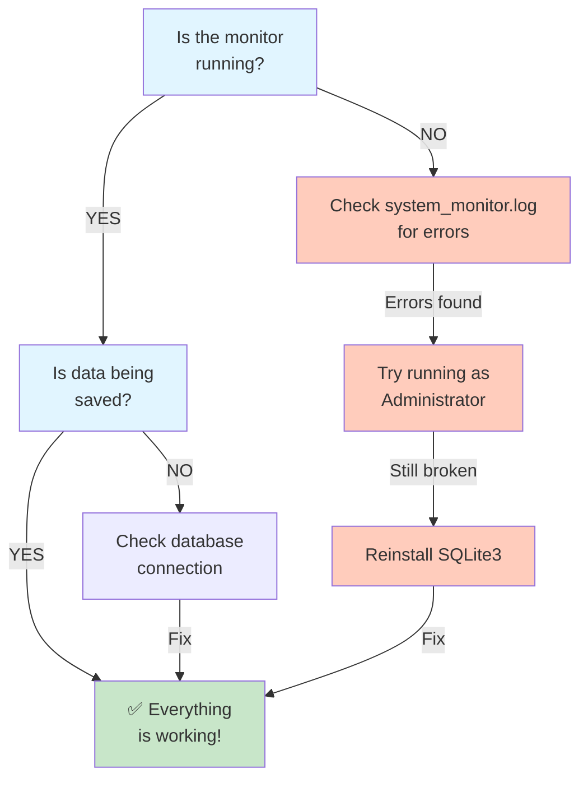

### Quick Checks:

1. **Check the log file** - Look at `system_monitor.log` to see if there are any errors

2. **Monitor disk space** - The database grows about 1-2 MB per day, so check you have space

3. **Verify data is being collected** - Open Command Prompt and type:

```bash
sqlite3 data/metrics.db
```

Then type these commands:

```sql
SELECT COUNT(*) FROM system_metrics;
SELECT MAX(timestamp) FROM system_metrics;
```

The first one shows how many measurements have been recorded.
The second one shows when the last measurement was taken.

If both show recent data, everything is working!

To exit, type `.exit`

## Troubleshooting (When Things Don't Work)

### Problem: Can't Connect to the Database

**Possible causes and fixes:**
1. The `data/` folder doesn't exist
   - **Fix:** Create it manually (right-click in File Explorer → New Folder → name it "data")

2. SQLite3 isn't installed properly
   - **Fix:** Reinstall it or check that it's in your system PATH

3. File permission issues
   - **Fix:** Run Command Prompt as Administrator

### Problem: PDH Errors (Performance Data Helper Errors)

**What this means:** The program can't read certain system information

**Fixes:**
- Some measurements need Administrator privileges - try running as Admin
- If it still doesn't work, the program falls back to basic measurements

### Problem: Database is Corrupted or Not Recording Data

**Quick fix:** Delete the old database and start fresh

```bash
del data/metrics.db
```

Then run the monitor again - it will create a new, clean database.

## What's Coming in the Future?

Here are features being considered for future versions:

- **Better CPU Tracking for Programs** - More accurate tracking of what each program uses
- **GPU Monitoring** - Track graphics card usage (for gaming, video editing, etc.)
- **Network Connection Details** - See which programs are using internet and which websites
- **Malware Detection** - Watch for suspicious file access patterns
- **File Access Logging** - See what programs are accessing your files
- **Real-time Alerts** - Get warnings immediately when problems occur
- **Web Dashboard** - A pretty website to view all your data
- **Better Integration** - Connect with anti-virus and security tools

## License & Usage

This project is for **educational purposes** - learn about how system monitoring works. Feel free to modify it and use it as a learning project.

---

**Project Timeline**: 1 Month
- **Week 1-2**: Core C monitor + data collection ✓ (IN PROGRESS)
- **Week 2-3**: Python ML models + feature engineering
- **Week 3-4**: Analysis, visualization, and testing
