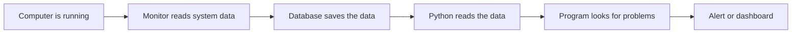

# Learning Notes for Beginners

This file is meant to be very easy to read.
You do not need to memorize everything.
The main idea is simple:

The project watches the computer, stores the data, and then tries to understand what is normal and what is not.

---

## 1. What this project is doing

Think of this project as a health check for a computer.

A doctor checks things like:
- pulse
- temperature
- breathing
- energy level

This project checks things like:
- CPU usage
- memory usage
- disk activity
- number of processes
- network activity

So the project is basically saying:

"Is the computer healthy right now?"

---

## 2. The simple flow

Easy version:
- the computer does work
- the C program watches it
- the database keeps a record
- Python looks at the record
- the project decides if something is normal or unusual

---

## 3. The 3 main parts

### Part 1: C monitor
This is the watcher.
It collects system health numbers from the computer.

Examples:
- CPU percentage
- memory used
- process count
- disk speed

### Part 2: Database
This is the storage box.
It keeps all of the readings in one place.

### Part 3: Python analysis
This is the brain.
It reads the saved data and tries to answer:
- Is this normal?
- Is this unusual?
- Is the system getting worse?
- Should we show a warning?

---

## 4. Very easy example

Imagine you are playing a game.

What happens?
1. CPU goes up
2. memory goes up
3. the monitor records it
4. Python reads the data later
5. Python notices: "This CPU use is high for a long time"
6. It may show an alert

This is like a doctor seeing:
- normal body data
- abnormal body data
- warning sign

---

## 5. The easiest way to read the code

Start in this order:

1. main.c
   - start here
   - this runs the program
2. metrics.c
   - this gathers the numbers
3. database.c
   - this saves the numbers
4. data_loader.py
   - this reads the database in Python
5. preprocessing.py
   - this cleans and prepares the data
6. anomaly_detection.py
   - this finds strange values
7. visualization.py
   - this creates plots and charts
8. real_time_alerts.py
   - this checks recent data and warns you
9. dashboard_report.py
   - this makes the dashboard summary

That order is easier than reading everything at once.

---

## 6. What the files are doing in plain English

### main.c
This is the starting point.
It starts the monitoring loop and keeps the program running.

### metrics.c
This file asks Windows for system values.
It collects the raw numbers.

### database.c
This file saves those numbers into the database.
Without this, the data would be lost.

### data_loader.py
This file opens the database and reads the stored results.
It turns them into Python tables.

### preprocessing.py
This file cleans the data.
It fills missing values and prepares the numbers for analysis.

### anomaly_detection.py
This file tries to spot unusual behavior.
It looks for values that are different from normal.

### trend_analysis.py
This file checks whether something is increasing or decreasing over time.

### visualization.py
This file draws graphs so you can understand the patterns visually.

### real_time_alerts.py
This file checks the newest data and creates warnings.

### dashboard_report.py
This file makes a summary page so someone can understand the system quickly.

---

## 7. The simplest mental model

Use this:

- C monitor = watchman
- Database = storage room
- Python analysis = detective
- Alert = warning sign
- Dashboard = summary sheet

Everything is connected to one goal:

"Watch the system, learn what is normal, and warn when something looks wrong."

---

## 8. Quick test

Try answering these without looking back:

1. What does the C monitor do?
2. What does the database do?
3. Why do we need Python analysis?
4. What is an anomaly?
5. Why do we make dashboards?
6. What is the difference between collecting data and analyzing data?

If you can answer those, you already understand the main idea.

---

## 9. Final reminder

You do not need to understand every line right now.
Focus on this instead:
- what each file does
- how data moves
- what the program is trying to detect

That is enough for a strong beginner start.
